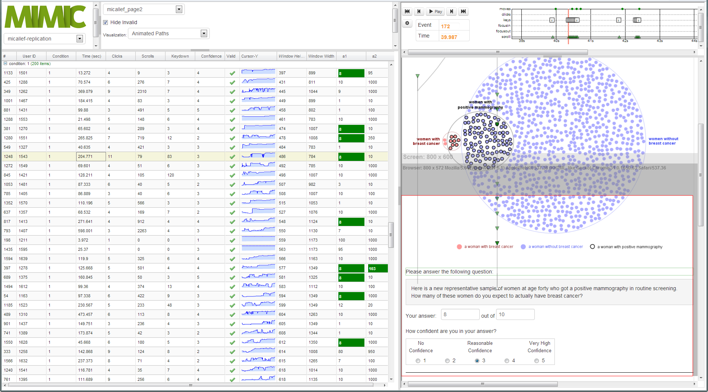

# Mimic

An input capture and visual analytics system that records online user behavior to facilitate the discovery of micro-interactions that may affect problem understanding and decision making.

This code was used in experiments done for this paper: [Project Page](http://autodeskresearch.com/publications/mimic)

## Reference

If you want to reference this code in an academic paper, please use this reference:
	
	@inproceedings{ Breslav-AVI-2014,
		author  = {Simon Breslav and Azam Khan and Kasper Hornbaek},
		title   = {Mimic: Visual Analysis of Online Micro-interactions},
		booktitle = {Proceedings of the 13th International Working Conference on Advanced Visual Interfaces 2014},
		location = {Como, Italy},
		year    = {2014},
		numpages = {8},
		publisher = {ACM}
	}

## Licence

[The MIT Licence](https://github.com/sbreslav/mimic/blob/master/LICENSE)

## Installation
**Warning**: These instructions need quite a bit of clarification.
**Warning**: This is "research code", and requires some configuration and tweaking to get working.

### Requirements

* [Python 2.7](https://www.python.org/download/releases/2.7.6) (may work with other versions) 
* [MySQL](http://dev.mysql.com/downloads/mysql/)
* Lots of python libraries (see [stable-req.txt](https://github.com/sbreslav/mimic/blob/master/stable-req.txt))

These are rough instructions for setting up Mimic, assuming your have all the pre-requisits installed:
- using command line navigate to the mimic folder that contains manage.py
- ``python manage.py syncdb``
- ``python manage.py migrate``
- ``python manage.py loaddata media\export_data\surveyData_micallef-replication.json``
- ``python manage.py runserver``
- open a browser and navigate to [http://localhost:8000/survey/admin](http://localhost:8000/survey/admin)
- defaults: username: admin, password: admin (can be chaned if you go to [http://localhost:8000/admin](http://localhost:8000/admin))
- The first time you run mimic you and select dataset, you have to click a link to process user interactions, this may take a while, but does not have to be repeated.

For more detailed information See [install.md](https://github.com/sbreslav/mimic/blob/master/install.md)

to create a db migration: do
- ``python .\manage.py schemamigration survey --auto``

## Docker & Docker Compose
* `sudo apt-get update`
* `sudo apt-get install curl`
* `curl -sSL https://get.docker.com/ | sh`
* `sudo usermod -aG docker $USER`
* Check: `sudo docker run hello-world`
* `sudo apt-get install python-setuptools`
* `sudo easy_install pip`
* `sudo pip install -U docker-compose==1.4.0`
* Add to ~/.profile:
  if [ -d "$HOME/.local/bin" ] ; then
  	PATH="$HOME/.local/bin:$PATH"
  fi
* `source ~/.profile`
* git clone https://github.com/sbreslav/mimic.git
* go to the folder that has docker-compose.yml
* create `pico .env` file to include:
	SECRET_KEY=<key>
	DB_NAME=postgres
	DB_USER=postgres
	DB_PASS=<pass>
	DB_SERVICE=postgres
	DB_PORT=5432
* `docker-compose build`
* `docker-compose run web python manage.py collectstatic`
* `docker-compose run web python manage.py syncdb`
* `docker-compose run web python manage.py migrate`
* `docker-compose up -d`
* Monitor:
	* `docker-compose ps`
	* `docker-compose run web env`
	* `docker-compose logs`
* Stop: `docker-compose stop`
* docker rm $(docker ps -a -q)
* docker rmi $(docker images | grep "^<none>" | awk "{print $3}")
* docker rmi $(docker images -q --filter "dangling=true")
* docker-compose run web /bin/bash
* localhost?worker_id=1&condition=0
* Git
  * `git remote` (check all the locations)
  * `git remote -v`
  * `git remote add autodesk https://github.com/sbreslav/designDEVS-IDE.git` (add a new repo)
  * `git push -u autodesk master`

